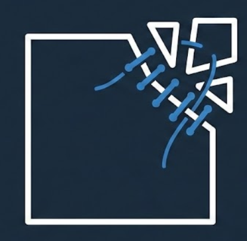
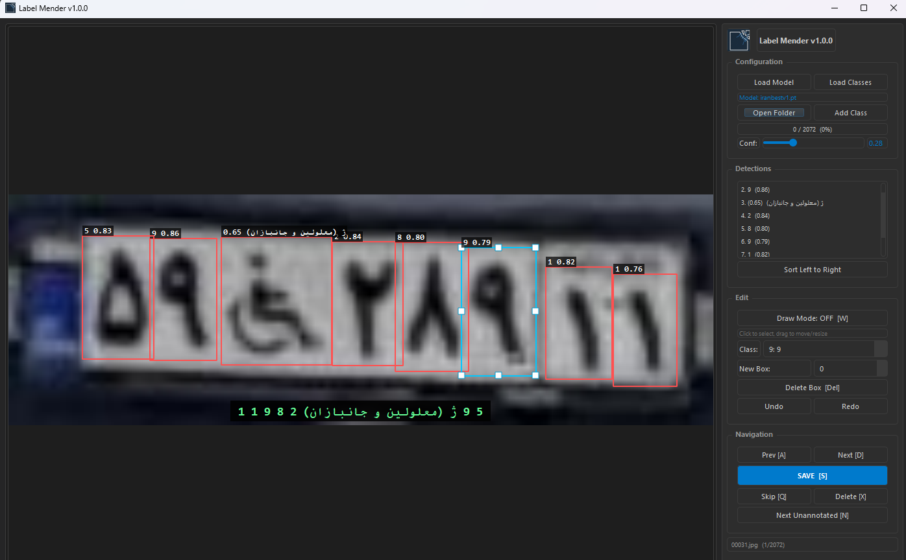

[](https://github.com/javadibrahimli/Label-Mender/stargazers)
[](https://github.com/javadibrahimli/Label-Mender/commits/main)
[](https://creativecommons.org/publicdomain/zero/1.0/)

[](https://github.com/javadibrahimli/Label-Mender)
[](https://github.com/javadibrahimli/Label-Mender)
[](https://github.com/javadibrahimli/Label-Mender)
[](https://www.python.org/)
[](https://pypi.org/project/PyQt5/)
[](https://github.com/javadibrahimli/Label-Mender/blob/main/CONTRIBUTING.md)

# Label Mender

<p align="center">

</p>

<p align="center">
<b>A professional YOLO annotation tool for refining and correcting model-generated labels.</b><br>
Built with PyQt5 for a smooth, native desktop experience on Windows, Linux, and macOS.
</p>

> **Note:** This is a basic tool I created specifically for labelers who work with YOLO annotations. It is **completely free and open source** — no premium features, no restrictions. Built for a specific use case: quickly fixing and refining model-generated labels.

<p align="center">

</p>

## Why Label Mender?

When training YOLO models, you often face these challenges:

- **Wrong class predictions** - Your model detects objects but assigns incorrect class labels
- **Low mAP accuracy** - Bounding boxes are not precise enough and need manual adjustment
- **Semi-automated labeling** - You want to use an existing model to speed up annotation, then manually fix errors

**Label Mender** solves this by letting you:

1. Load your trained YOLO model (.pt file)
2. Run inference on your images to get initial detections
3. Quickly review and correct class labels with number keys (1-9)
4. Adjust bounding box positions and sizes by dragging
5. Add missing boxes or delete false positives
6. Save corrected annotations in YOLO format

<p align="center">

</p>

<p align="center"><i>Edit model detections: fix incorrect classes and adjust bounding box positions</i></p>

## Install

<details><summary>Prerequisites</summary>

* **[Python 3.8+](https://www.python.org/)**

* **[PyQt5](https://pypi.org/project/PyQt5/)**

* **[Ultralytics YOLO](https://github.com/ultralytics/ultralytics)** (optional, for auto-detection)

<hr>
</details>

### Clone the repository:

```bash
git clone https://github.com/javadibrahimli/Label-Mender.git
cd Label-Mender
```

### Install dependencies:

```bash
pip install -r requirements.txt
```

### Run the application:

```bash
python app.py
```

## Workflow

```
┌─────────────────┐     ┌─────────────────┐     ┌─────────────────┐
│  Load Model     │ --> │  Open Images    │ --> │  Auto-detect    │
│  (.pt file)     │     │  Folder         │     │  Objects        │
└─────────────────┘     └─────────────────┘     └─────────────────┘
                                                        │
                                                        v
┌─────────────────┐     ┌─────────────────┐     ┌─────────────────┐
│  Save & Next    │ <-- │  Adjust Boxes   │ <-- │  Fix Classes    │
│  Image          │     │  (drag/resize)  │     │  (press 1-9)    │
└─────────────────┘     └─────────────────┘     └─────────────────┘
```

## Features

| Feature | Description |
|---------|-------------|
| **Cross-Platform** | Works on Windows, Linux, and macOS |
| **Model-Assisted Labeling** | Use your YOLO model for initial detections, then correct errors |
| **Quick Class Correction** | Press number keys 1-9 to instantly change box class |
| **Interactive Box Editing** | Click to select, drag to move, resize via corner/edge handles |
| **Draw Mode** | Create new bounding boxes for missed detections |
| **Confidence Filtering** | Adjust threshold to show/hide low-confidence detections |
| **Batch Navigation** | Navigate through image folders with progress tracking |
| **Undo/Redo** | Full undo/redo support for all operations |
| **YOLO Format** | Native support for YOLO annotation format (.txt files) |

## Keyboard Shortcuts

| Key | Action |
|-----|--------|
| `W` | Toggle Draw Mode |
| `A` | Previous Image |
| `D` | Next Image |
| `S` | Save Annotations |
| `Q` | Skip Image |
| `N` | Next Unannotated Image |
| `X` | Delete Current Image |
| `Del` | Delete Selected Box |
| `Esc` | Deselect / Exit Draw Mode |
| `1-9` | Set class of selected box |
| `Ctrl+Z` | Undo |
| `Ctrl+Y` | Redo |
| `Ctrl+S` | Save |

## Project Structure

```
Label-Mender/
├── app.py                  # Application entry point
├── requirements.txt        # Python dependencies
├── icon/                   # Application icons
│   └── icon.png
├── src/
│   ├── main.py            # Main initialization
│   ├── config/            # Configuration and styling
│   │   ├── constants.py   # App constants and colors
│   │   └── styles.py      # Qt stylesheets
│   ├── core/              # Core business logic
│   │   ├── annotation_manager.py
│   │   ├── model_manager.py
│   │   └── state_manager.py
│   ├── ui/                # User interface components
│   │   ├── main_window.py
│   │   └── image_canvas.py
│   └── utils/             # Utility functions
│       ├── file_operations.py
│       └── geometry.py
└── test/                  # Unit tests
```

## Troubleshooting

<details><summary>PyQt5 installation fails on Linux</summary>

On some Linux distributions, you may need to install system dependencies first:

```bash
sudo apt-get install python3-pyqt5
```

Or install via pip with:

```bash
pip install PyQt5
```

<hr>
</details>

<details><summary>YOLO model not loading</summary>

Ensure you have the `ultralytics` package installed:

```bash
pip install ultralytics
```

The model file must be a valid `.pt` file trained with Ultralytics YOLO.

<hr>
</details>

<details><summary>Images not displaying correctly</summary>

Supported image formats:
- `.jpg` / `.jpeg`
- `.png`
- `.bmp`

Ensure your images are in one of these formats and not corrupted.

<hr>
</details>

<details><summary>Class names not showing</summary>

You can load class names from:
1. **YAML file** - Standard YOLO data.yaml format
2. **TXT file** - One class name per line
3. **From model** - Automatically loaded if the model contains class names

<hr>
</details>

## Roadmap

This tool was created specifically for **data labellers** who work with YOLO models daily. I'm actively developing new features to make annotation workflows faster and easier.

**Upcoming Features:**

- [ ] **VLM Integration** - Vision Language Models for intelligent object recognition and labeling suggestions
- [ ] **SAM Integration** - Segment Anything Model for precise, one-click segmentation masks
- [ ] **Local Model Support** - Run VLM and SAM models locally without requiring external APIs
- [ ] Support for more YOLO modes (segmentation, pose estimation)
- [ ] Batch processing - run inference on entire folders
- [ ] File renaming utilities
- [ ] Export to multiple formats (COCO, Pascal VOC)
- [X] Zoom and pan controls
- [ ] Auto-save functionality
- [ ] Dataset statistics and visualization
- [ ] Dark/Light theme toggle

Stay tuned for updates!

## Contributing

Contributions are welcome! If you have ideas for new features or improvements, feel free to:

- **Fork** the repository and experiment
- **Submit Pull Requests** with your changes
- **Open Issues** to suggest features or report bugs

1. Fork the repository
2. Create your feature branch (`git checkout -b feature/AmazingFeature`)
3. Commit your changes (`git commit -m 'Add some AmazingFeature'`)
4. Push to the branch (`git push origin feature/AmazingFeature`)
5. Open a Pull Request

All contributions, big or small, are greatly appreciated!

## Author

**Javad Ibrahimli**

I created Label Mender to help labellers and ML engineers save time when refining YOLO annotations. If you find this tool useful, consider giving it a star!

## License

This project is licensed under the [CC0 1.0 Universal](https://creativecommons.org/publicdomain/zero/1.0/); see the [LICENSE](LICENSE) file for details.
